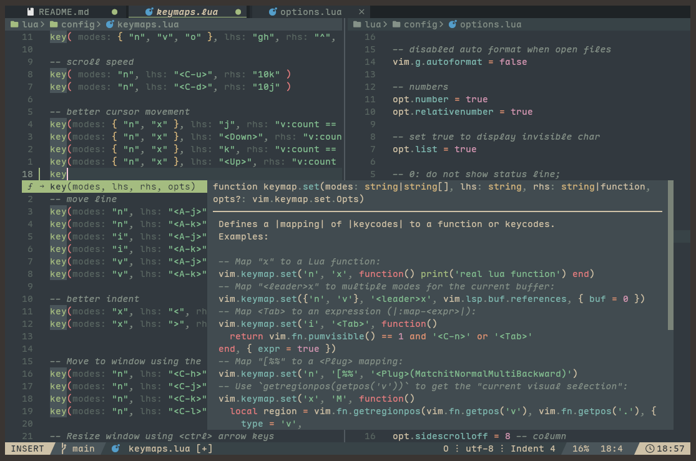

<div align="center">
    <h1>𝓒𝓸𝓭𝓮𝓝𝓿𝓲𝓶</h1>
    <p>我的Neovim配置，使用lazy.nvim插件管理的编辑器</p>
    <div>
        <a href="#简介"></a>
        <a href="https://neovim.io/"></a>
        <a href="https://www.lazyvim.org/"></a>
    </div>
    
</div>

## 简介

我的neovim配置。过去我使用的是 `LazyVim`，这是一个不错的Neovim“发行版”，但是我发现我还是会去配置很多添加很多插件。所以我索性就重新配置了一个我自己的Neovim。

注意，该项目不算一个发布的产品，只是我自己的配置仓库。我的配置会很大程度的参考LazyVim，所以你会发现我的很多插件和配置和LazyVim一样。我从中选取了大部分我觉得好用且有用的插件，然后在此基础上添加了一些我认为需要用到的实用或者美化插件。

如果你正在寻找一个不错的Neovim配置，那么我向你推荐 [LazyVim](https://www.lazyvim.org/)。当然你也可以参考我的配置，希望可以帮到你。

> 这个配置需要Neovim >= 0.11.2，如果你是用的终端字体支持Nerd font体验会更好。

## 使用

下面是在 `Linux`上使用CodeNvim的方法，配置在其他系统中不保证功能完整。

在Linux上使用CodeNvim的配置前，你需要保证你备份了现有的配置文件和资源：
```
mv ~/.config/nvim{,.bak}

mv ~/.local/share/nvim{,.bak}

mv ~/.local/state/nvim{,.bak}

mv ~/.cache/nvim{,.bak}
```

接着将仓库克隆到 `~/.config/nvim/`：
```
git clone ~/.config/nvim
```
在终端中运行 `nvim` 就好啦！

## 配置结构

Neovim的入口文件是 `init.lua`，所有的基本配置在 `lua/config` 下，插件配置在 `lua/plugins` 下。

```
nvim
├── init.lua
├── lazy-lock.json
├── lua/
│   ├── config/
│   └── plugins/
└── README.md
```

具体使用的插件以及具体的插件配置请参考： [Features](./features.md)

## TODO

- [ ] 添加Debug相关功能
- [ ] 修改默认语言服务器安装列表
- [ ] 启动页配置
- [ ] 代码块折叠配置
- [ ] 完善neo-tree配置
- [ ] 安装多光标插件
